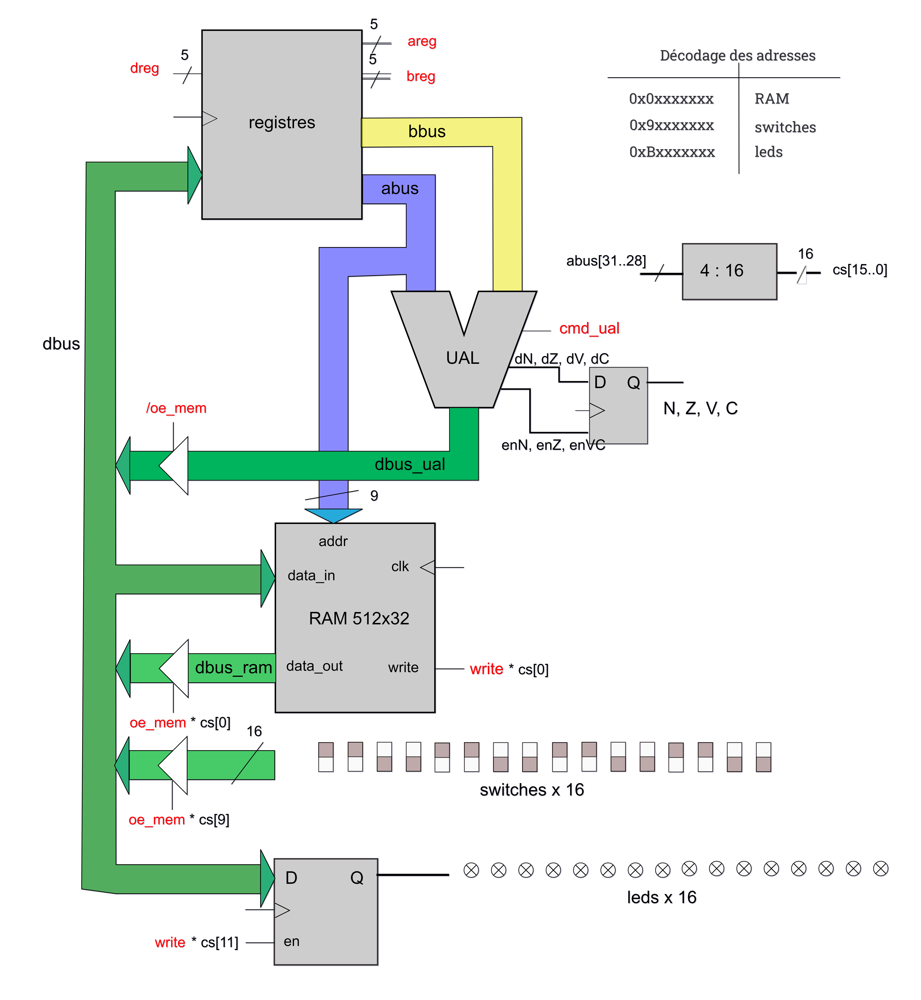
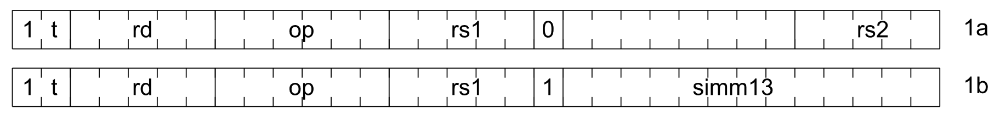
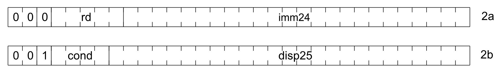

# Microprocesseur en CRAPS
Ce projet a été réalisé dans le cadre d'un TP (Travaux Pratiques) dirigé par [Jean-Christophe Buisson](https://fr.linkedin.com/in/jean-christophe-buisson) et appuyé sur son [livre](https://amazon.fr/stores/Jean-Christophe-Buisson/author/B004N2KQXM) à l'[ENSEEIHT](https://www.enseeiht.fr/).

Le but de ce projet était d'implémenter en SHDL un microprocesseur CRAPS. CRAPS est un microprocesseur 32 bits basé sur l'architecture SPARC, qui appartient à la famille des architectures RISC*. Son jeu d'instructions est simplifié, permettant l'exécution de la majorité des opérations en un seul cycle, ce qui optimise à la fois la vitesse et la simplicité de conception.

> [!NOTE]
> SHDL est un langage pour décrire les circuits numériques d'une manière simple et modulaire. 
> Il ne s'agit pas d'un langage de programmation, mais de description des différents équipotentiels qui composent un circuit et de leurs relations combinatoires ou séquentielles. 
> Une fois qu'une conception a été décrite correctement en SHDL, elle peut être « alimentée » et diffusée par simulation ou synthèse dans un véritable circuit FPGA.

En comparaison avec la famille de processeurs CISC, comme ceux basés sur l'architecture x86, les processeurs CISC consomment généralement plus d'énergie. En effet, pour réaliser une opération, ils doivent passer par plusieurs cycles d'horloge.

Voici un tableau comparatif des architectures CISC et RISC :

| **CISC**                                            | **RISC**                                          |
|-----------------------------------------------------|---------------------------------------------------|
| Moins de registres                                  | Plus de registres                                 |
| Plus de modes d'adressage                           | Moins de modes d'adressage                        |
| Les instructions prennent un temps de cycle variable| Les instructions prennent un cycle unique         |
| Le pipelining est difficile                         | Le pipelining est facilité                        |

## Architecture générale du microprocesseur CRAPS
Notre microprocesseur possède plusieurs composants, séparés en 2 grandes parties :
1. Micromachine  
    > [!TIP]
    > Vous pouvez retrouver en détail l'implémentation de la micromachine dans les codes fournis [shdl/modules/micromachine](https://github.com/Darcolosse/craps-microprocessor/blob/main/shdl/modules/micromachine).
2. Séquenceur  
    > [!TIP]
    > Vous pouvez retrouver en détail l'implémentation du séquenceur dans les codes fournis [shdl/modules/sequencer](https://github.com/Darcolosse/craps-microprocessor/blob/main/shdl/modules/sequencer).

## La micromachine

La micromachine constitue le cœur du processeur, intégrant plusieurs composants essentiels :
- **Registres** (d’architecture interne)
- **Unité Arithmétique et Logique** (UAL)
- Mémoire **RAM** 512x32 bits
- Entrée **Switches** (16 switches)
- Sortie **LEDs** (16 LEDs)

Pour assurer la communication entre ces modules, la micromachine utilise trois bus principaux :
- **dbus** : Bus de données
- **abus** : Bus d’adresses
- **bbus** : Bus de contrôle (signaux de commande)

### Fonctionnement et interactions
Le schéma général de la micromachine (voir ci-dessous) illustre comment ces composants sont reliés et comment ils interagissent pour réaliser les opérations du microprocesseur.

#### Pourquoi un court-circuit est-il impossible sur le bus D (dbus) ?
La conception du bus inclut des mécanismes de contrôle (par exemple, des signaux d’activation et de sélection) qui empêchent plusieurs modules d’écrire simultanément sur le bus, évitant ainsi tout court-circuit.

#### Lecture et écriture en RAM :
La RAM est accessible via le module **$ram_aread_swrite(clk, write, abus[8..0], dbus[31..0]: dbus_ram[31..0])**. Lorsqu’un signal write est actif, la donnée **dbus** est stockée à l’adresse **abus**. En l’absence de ce signal, la RAM fournit la donnée présente à l’adresse spécifiée.

#### Calcul sur deux registres et stockage du résultat :
Les registres **abus** et **bbus** contiennent les opérandes. L’UAL effectue l’opération demandée et stocke le résultat soit dans un registre, soit dans la RAM.

#### Contrôle des LEDs :
La sortie leds[15..0] est directement reliée à des LEDs physiques contrôlées par la micromachine, permettant d’afficher des états ou des résultats.

#### Lecture des switches :
L’entrée switches[15..0] permet de récupérer l’état des switches physiques, qui peuvent servir d’entrées pour des opérations ou des tests.

### Le registre

Notre processeur possède un ensemble de registres, les voici :

| Référence  | Fonction                                               |
|------------|--------------------------------------------------------|
| %r0        | Registre **zéro**, valeur constante, utilisé pour opérations logiques et comme source de zéro |
| ...        |                                                        |
| %r20       | Registre qui est constamment égal à **un**             |
| %r21 (tmp1)| Registre contenant des valeurs temporaires             |
| ...  (tmpX)|                                                        |
| %r26 (brk) |                                                        |
| %r27 (fp)  | Pointeur à la base du **stack-frame** courant          |
| %r28 (ret) | Utilisé pour sauvegarder l’adresse de retour lors d’appels de sous-programmes |
| %r29 (sp)  | Pointeur du sommet de pile                             |
| %r30 (pc)  | Correspond au Programme Counter, qui contient en permanence l'adresse de l'instruction en cours |
| %r31 (ir)  | Registre d'instruction du processeur                   |

> [!NOTE]
> Une **stack-frame** est une zone de mémoire sur la pile (stack) créée chaque fois qu'on entre dans un bloc ou qu'on appelle une fonction.
> Elle sert à stocker les variables locales, les paramètres de la fonction ou du bloc, et l'adresse de retour (pour revenir à l'endroit où l'on était avant l'appel).

> [!TIP]
> Vous pouvez retrouver en détail l'implémentation du registre dans les codes fournis [shdl/modules/registers](https://github.com/Darcolosse/craps-microprocessor/blob/main/shdl/modules/registers).

### L'UAL
L'Unité Arithmétique et Logique (UAL) est un composant essentiel du processeur, chargé d'effectuer des opérations arithmétiques et logiques sur des données. Elle reçoit plusieurs entrées et fournit des sorties correspondant aux résultats de ces opérations, ainsi que des indicateurs d’état (flags).

#### Entrées de l'UAL
- **abus** : Bus de données contenant l'opérande A à traiter.
- **bbus** : Bus de données contenant l'opérande B à traiter.
- **cmd_alu** : Code opération, déterminant l’opération à effectuer. Sa valeur binaire sur 6 bits indique l’opération spécifique selon le tableau ci-dessous.

#### Sorties de l'UAL
- **dbus_alu** : Bus de données de sortie, contenant le résultat de l’opération effectuée.
- **Flags (N, Z, V, C)** : Bits indicateurs d’état, modifiés ou non selon l’opération.
- **enN, enZ, enV, enC** : Signaux d’activation pour la mise à jour des flags, indiquant si chaque flag doit être affecté par l’opération en cours.

Quand nous voulons effectuer une opération, nous avons en entrée deux opérandes et une instruction contenant l'opération à effectuer (**cmd_alu**). Pour comprendre à quoi correspondent les mots binaires de 6 bits dans **cmd_alu**, voici un tableau récapitulatif des opérations associées à chaque code :

| cmd         | opération                                            | flags modifiés      |
|-------------|------------------------------------------------------|---------------------|
| 010000 (16) | ADDCC, addition                                      | N, Z, V, C          |
| 010100 (20) | SUBCC, soustraction                                  | N, Z, V, C          |
| 011010 (26) | UMULCC, multiplication non signée                    | Z                   |
| 010001 (17) | ANDCC, et logique bit à bit                          | N, Z                |
| 010010 (18) | ORCC, ou logique bit à bit                           | N, Z                |
| 010011 (19) | XORCC, xor logique bit à bit                         | N, Z                |
| 000000 (0)  | ADD, addition                                        | aucun               |
| 000100 (4)  | SUB, soustraction                                    | aucun               |
| 000001 (1)  | AND, et logique bit à bit                            | aucun               |
| 000010 (2)  | OR, ou logique bit à bit                             | aucun               |
| 000011 (3)  | XOR, xor logique bit à bit                           | aucun               |
| 001101 (13) | Décalage à droite                                    | aucun               |
| 001110 (14) | Décalage à gauche                                    | aucun               |
| 100000 (32) | SIGNEXT13, extension de signe bus A, 13 bits→32 bits | aucun               |
| 100001 (33) | SIGNEXT25, extension de signe bus A, 25 bits→32 bits | aucun               |
| 100011 (35) | SETHI, forçage des 24 bits de poids forts            | aucun               |
| 101000 (40) | NOPB, no operation bus B                             | aucun               |

> [!NOTE]
> #### Qu'est-ce qu'un flag (N, Z, V, C) ?
> Les flags (ou indicateurs d’état) sont des bits spéciaux qui renseignent sur le résultat des opérations effectuées par l’UAL. Par exemple :
> - **N** indique que le résultat de l’opération est négatif, c’est-à-dire que son poids fort est à 1.
> - **Z** indique que le résultat de l’opération est nul.
> - **V** indique qu’il y a eu débordement d’une addition ou d’une soustraction signée.
> - **C** indique qu’il y a eu une retenue lors d’une addition ou un emprunt lors d’une soustraction.

> [!TIP]
> Vous pouvez retrouver en détail l'implémentation de l'UAL dans les codes fournis [shdl/modules/alu](https://github.com/Darcolosse/craps-microprocessor/blob/main/shdl/modules/alu).

## Séquenceur

Le séquenceur permet de récupérer la valeur du registre 31 (ir). Cette valeur correspond à l'instruction de registre, elle permet notamment de pouvoir "ordonner" comment se passe une instruction.
Notre séquenceur possède deux formats binaires :

### Format 1 : Instructions arithmétiques et accès mémoire
L'instruction est composée d'un mot de 32 bits sous la forme suivante :

- **t** : La valeur de **t** (bit 30) spécifie si c'est une instruction arithmétique (t=0) ou un accès mémoire (t=1)
- **rd** : Ces 5 bits (bits 25-29) correspondent au registre de destination
- **op** : Ces 6 bits (bits 19-24) correspondent à l'opération demandée comme on retrouvait dans l'UAL
- **rs1** : Ces 5 bits (14-18) font référence à une valeur numérique dans le registre A
- **rs2** : Ces 5 bits (0-4) font référence à une valeur numérique dans le registre B
- **simm13** : Ces 13 bits (0-12) font référence à une constante sur 13 bits
- **bit 13** : Quand celui-ci est à un, cela signifie que nous allons faire un calcul avec une constante.

### Format 2 : Instructions de branchement et de sethi
L'instruction est composée d'un mot de 32 bits sous la forme suivante :

- **bit 29** : Spécifie s'il s'agit d'un calcul ou d'un load/store
- **rd** : Ces 5 bits (bits 24-28) correspondent au registre de destination
- **cond** : Ces 4 bits (bits 25-28) font référence au type de branchement sur 4 bits
- **imm24** : Ces 24 bits (0-23)
- **disp25** : Ces 25 bits (0-24)
