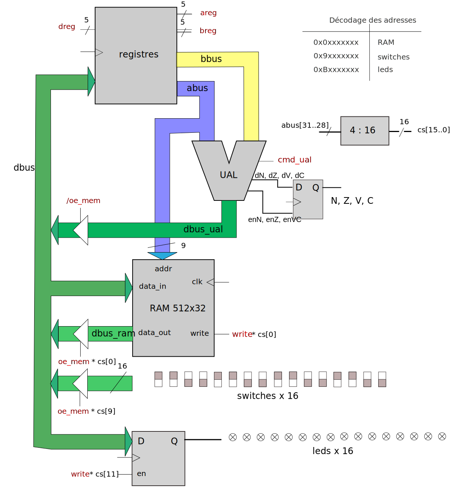

# Micro processeur en CRAPS
Ce projet a été réalisé dans le cadre d'un TP (Travaux Pratiques) dirigé par  [Jean-Christophe Buisson](https://fr.linkedin.com/in/jean-christophe-buisson) et appuyé sur son  [livre](https://amazon.fr/stores/Jean-Christophe-Buisson/author/B004N2KQXM) à l'[ENSEEIHT](https://www.enseeiht.fr/).

Le but de ce projet était d'implémenter en SHDL* un microprocesseur CRAPS. CRAPS est un microprocesseur 32 bits basé sur l'architecture SPARC, qui appartient à la famille des architectures RISC*. Son jeu d'instructions est simplifié, permettant l'exécution de la majorité des opérations en un seul cycle, ce qui optimise à la fois la vitesse et la simplicité de conception.

En comparaison avec la famille de processeurs CISC, comme ceux basés sur l'architecture x86, les processeurs CISC consomment généralement plus d'énergie. En effet, pour réaliser une opération, ils doivent passer par plusieurs cycles d'horloge.

Voici un tableau comparatif des architectures CISC et RISC :

| **CISC**                                            | **RISC**                                          |
|-----------------------------------------------------|---------------------------------------------------|
| Moins de registres                                  | Plus de registres                                 |
| Plus de modes d'adressage                           | Moins de modes d'adressage                        |
| Les instructions prennent un temps de cycle variable| Les instructions prennent un cycle unique         |
| Le pipelining est difficile                         | Le pipelining est facilité                        |

## Architecture général du micro processeur CRAPS
Notre micro processeur possède plusieurs composants, séparé en 2 grandes partie :
1. Micro machine
> [!TIP]
> Vous pouvez retrouver en détails l'implémentation de la micromachine dans les codes fournis [shdl/modules/micromachine](https://github.com/Darcolosse/craps-microprocessor/blob/main/shdl/modules/micromachine).
2. Séquenceur
> [!TIP]
> Vous pouvez retrouver en détails l'implémentation du séquenceur dans les codes fournis [shdl/modules/sequencer](https://github.com/Darcolosse/craps-microprocessor/blob/main/shdl/modules/sequencer).

### La micromachine

La micromachine constitue le cœur du processeur, intégrant plusieurs composants essentiels :
- **Registres** (d’architecture interne)
- **Unité Arithmétique et Logique** (UAL)
- Mémoire **RAM** 512x32 bits
- Entrée **Switches** (16 switches)
- Sortie **LEDs** (16 LEDs)

Pour assurer la communication entre ces modules, la micromachine utilise trois bus principaux :
- **dbus** : Bus de données
- **abus** : Bus d’adresses
- **bbus** : Bus de contrôle (signaux de commande)

#### Fonctionnement et interactions
Le schéma général de la micromachine (voir ci-dessous) illustre comment ces composants sont reliés et comment ils interagissent pour réaliser les opérations du microprocesseur.

##### Pourquoi un court-circuit est impossible sur le bus D (dbus) ?
La conception du bus inclut des mécanismes de contrôle (par exemple, des signaux d’activation et de sélection) qui empêchent plusieurs modules d’écrire simultanément sur le bus, évitant ainsi tout court-circuit.

##### Lecture et écriture en RAM :
La RAM est accessible via le module **$ram_aread_swrite(clk, write, abus[8..0], dbus[31..0]: dbus_ram[31..0])**. Lorsqu’un signal write est actif, la donnée **abus** est stockée à l’adresse **dbus**. En l’absence de ce signal, la RAM fournit la donnée présente à l’adresse spécifiée.

##### Calcul sur deux registres et stockage du résultat :
Les registres **abus** et **bbus** contiennent les opérandes. L’UAL effectue l’opération demandée, et stocke le résultat soit dans un registre soit dans la RAM.

##### Contrôle des LEDs :
La sortie leds[15..0] est directement reliée à des leds physique contrôlée par la micromachine, permettant d’afficher des états ou des résultats.

##### Lecture des switches :
L’entrée switches[15..0] permet de récupérer l’état des switches physiques, qui peuvent servir d’entrées pour des opérations ou des tests.

#### Le registre

> [!TIP]
> Vous pouvez retrouver en détails l'implémentation du registre dans les codes fournis [shdl/modules/registers](https://github.com/Darcolosse/craps-microprocessor/blob/main/shdl/modules/registers).

#### L'UAL*
L'Unitée Arithmétique et Logique (UAL*) est un composant essentiel du processeur, chargé d'effectuer des opérations arithmétiques et logiques sur des données. Elle reçoit plusieurs entrées et fournit des sorties correspondant aux résultats de ces opérations, ainsi que des indicateurs d’état (flags).

##### Entrées de l'UAL*
- **abus** : Bus de donnée contenant l'opérande A à traiter.
- **bbus** : Bus de donnée contenant l'opérande B à traiter.
- **cmd_alu** : Code opération, déterminant l’opération à effectuer. Sa valeur binaire sur 6 bits indique l’opération spécifique selon le tableau ci-dessous.

##### Sorties de l'UAL*
- **dbus_alu** : Bus de données de sortie, contenant le résultat de l’opération effectuée.
- **Flags (N, Z, V, C)** : Bits indicateurs d’état, modifiés ou non selon l’opération.
- **enN, enZ, enV, enC** : Signaux d’activation pour la mise à jour des flags, indiquant si chaque flag doit être affecté par l’opération en cours.

Quand nous voulons effectuer une opération, nous avons en entrée deux opérandes et une instruction contenant l'opération à effectuer (**cmd_alu**). Pour comprendre à quoi correspondent les mots binaires de 6 bits dans **cmd_alu**, voici un tableau récapitulatif des opérations associées à chaque code :

| cmd         | opération                                            | flags modifiés      |
|-------------|------------------------------------------------------|---------------------|
| 010000 (16) | ADDCC, addition                                      | N, Z, V, C          |
| 010100 (20) | SUBCC, soustraction                                  | N, Z, V, C          |
| 011010 (26) | UMULCC, multiplication non signée                    | Z                   |
| 010001 (17) | ANDCC, et logique bit à bit                          | N, Z                |
| 010010 (18) | ORCC, ou logique bit à bit                           | N, Z                |
| 010011 (19) | XORCC, xor logique bit à bit                         | N, Z                |
| 000000 (0)  | ADD, addition                                        | aucun               |
| 000100 (4)  | SUB, soustraction                                    | aucun               |
| 000001 (1)  | AND, et logique bit à bit                            | aucun               |
| 000010 (2)  | OR, ou logique bit à bit                             | aucun               |
| 000011 (3)  | XOR, xor logique bit à bit                           | aucun               |
| 001101 (13) | Décalage à droite                                    | aucun               |
| 001110 (14) | Décalage à gauche                                    | aucun               |
| 100000 (32) | SIGNEXT13, extension de signe bus A, 13 bits→32 bits | aucun               |
| 100001 (33) | SIGNEXT25, extension de signe bus A, 25 bits→32 bits | aucun               |
| 100011 (35) | SETHI, forçage des 24 bits de poids forts            | aucun               |
| 101000 (40) | NOPB, no operation bus B                             | aucun               |

##### C'est quoi un flag (N, Z, V, C) ?

    Les flags (ou indicateurs d’état) sont des bits spéciaux qui renseignent sur le résultat des opérations effectuées par l’UAL. Par exemple :

- **N** indique que le résultat de l’opération est négatif, c’est à dire que son poids fort est à 1.
- **Z** indique que le résultat de l’opération est nul.
- **V** indique qu’il y a eu débordement d’une addition ou d’une soustraction signée.
- **C** indique qu’il y a eu une retenue lors d’une addition ou emprunt lors d’une soustraction

Les flags sont uutilisé dans pour les branchements, voici la liste de lutilisation de ses branchements :

> [!TIP]
> Vous pouvez retrouver en détails l'implémentation de l'UAL dans les codes fournis [shdl/modules/alu](https://github.com/Darcolosse/craps-microprocessor/blob/main/shdl/modules/alu).

#### Management des bus et des E/S*
