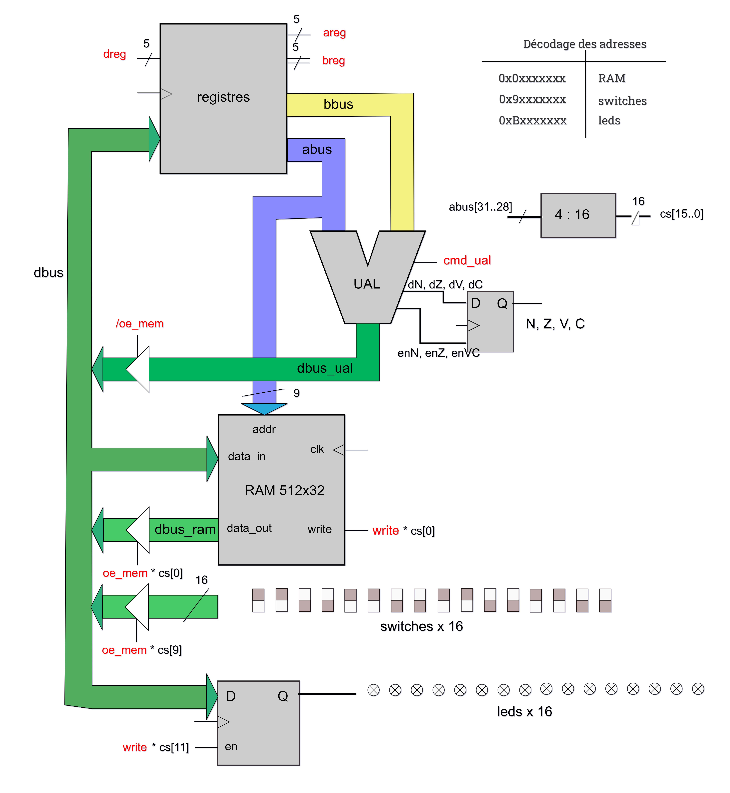
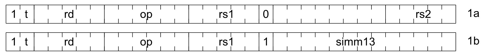
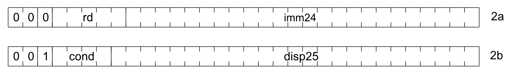

# CRAPS Microprocessor

> [!CAUTION]
> THIS README HAS BEEN AUTOMATICALLY TRANSLATED

This project was carried out as part of a lab (Travaux Pratiques) led by [Jean-Christophe Buisson](https://fr.linkedin.com/in/jean-christophe-buisson) and based on his [book](https://amazon.fr/stores/Jean-Christophe-Buisson/author/B004N2KQXM) at [ENSEEIHT](https://www.enseeiht.fr/).

The goal of this project was to implement a CRAPS microprocessor in SHDL. CRAPS is a 32-bit microprocessor based on the SPARC architecture, which belongs to the RISC* family. Its instruction set is simplified, allowing most operations to be executed in a single cycle, optimizing both speed and design simplicity.

> [!NOTE]
> SHDL (Simple Hardware Description Language) is a language for describing digital circuits in a simple and modular way.
> It is not a programming language, but a description of the different equipotentials that make up a circuit and their combinatorial or sequential relationships.
> Once a design has been correctly described in SHDL, it can be "powered" and deployed by simulation or synthesis into a real FPGA circuit.

Compared to the CISC processor family, such as those based on the x86 architecture, CISC processors generally consume more energy. Indeed, to perform an operation, they must go through several clock cycles.

Here is a comparative table of CISC and RISC architectures:

| **CISC**                                            | **RISC**                                          |
|-----------------------------------------------------|---------------------------------------------------|
| Fewer registers                                     | More registers                                    |
| More addressing modes                               | Fewer addressing modes                            |
| Instructions take a variable number of cycles       | Instructions take a single cycle                  |
| Pipelining is difficult                             | Pipelining is facilitated                         |

## General Architecture of the CRAPS Microprocessor

Our microprocessor has several components, divided into two main parts:
1. Micromachine  
> [!TIP]
> You can find the detailed implementation of the micromachine in the provided code [shdl/modules/micromachine](https://github.com/Darcolosse/craps-microprocessor/blob/main/shdl/modules/micromachine).
2. Sequencer  
> [!TIP]
> You can find the detailed implementation of the sequencer in the provided code [shdl/modules/sequencer](https://github.com/Darcolosse/craps-microprocessor/blob/main/shdl/modules/sequencer).

## The Micromachine

The micromachine is the heart of the processor, integrating several essential components:
- **Registers** (internal architecture)
- **Arithmetic and Logic Unit** (ALU)
- **RAM** memory 512x32 bits
- **Switches** input (16 switches)
- **LEDs** output (16 LEDs)

To ensure communication between these modules, the micromachine uses three main buses:
- **dbus**: Data bus
- **abus**: Address bus
- **bbus**: Control bus (command signals)

### Operation and Interactions

The general diagram of the micromachine (see below) shows how these components are connected and how they interact to perform microprocessor operations.

#### Why is a short circuit impossible on the D bus (dbus)?

The bus design includes control mechanisms (e.g., enable and select signals) that prevent multiple modules from writing to the bus simultaneously, thus avoiding any short circuit.

#### RAM Read and Write:

RAM is accessible via the module **$ram_aread_swrite(clk, write, abus[8..0], dbus[31..0]: dbus_ram[31..0])**. When a write signal is active, the **dbus** data is stored at the **abus** address. In the absence of this signal, RAM provides the data present at the specified address.

#### Calculation on Two Registers and Storing the Result:

The **abus** and **bbus** registers contain the operands. The ALU performs the requested operation and stores the result either in a register or in RAM.

#### LED Control:

The leds[15..0] output is directly connected to physical LEDs controlled by the micromachine, allowing states or results to be displayed.

#### Reading Switches:

The switches[15..0] input allows the state of the physical switches to be retrieved, which can be used as inputs for operations or tests.

### The Register

Our processor has a set of registers, as follows:

| Reference   | Function                                               |
|-------------|--------------------------------------------------------|
| %r0         | **Zero** register, constant value, used for logical operations and as a source of zero |
| ...         |                                                        |
| %r20        | Register that is constantly equal to **one**           |
| %r21 (tmp1) | Register containing temporary values                   |
| ...  (tmpX) |                                                        |
| %r26 (brk)  |                                                        |
| %r27 (fp)   | Pointer to the base of the current **stack-frame**     |
| %r28 (ret)  | Used to save the return address during subroutine calls|
| %r29 (sp)   | Stack pointer                                          |
| %r30 (pc)   | Corresponds to the Program Counter, which always contains the address of the current instruction |
| %r31 (ir)   | Processor instruction register                         |

> [!NOTE]
> A **stack-frame** is a memory area on the stack created each time you enter a block or call a function.
> It is used to store local variables, function or block parameters, and the return address (to return to where you were before the call).

> [!TIP]
> You can find the detailed implementation of the register in the provided code [shdl/modules/registers](https://github.com/Darcolosse/craps-microprocessor/blob/main/shdl/modules/registers).

### The ALU

The Arithmetic and Logic Unit (ALU) is an essential component of the processor, responsible for performing arithmetic and logical operations on data. It receives several inputs and provides outputs corresponding to the results of these operations, as well as status indicators (flags).

#### ALU Inputs

- **abus**: Data bus containing operand A to process.
- **bbus**: Data bus containing operand B to process.
- **cmd_alu**: Operation code, determining the operation to perform. Its 6-bit binary value indicates the specific operation according to the table below.

#### ALU Outputs

- **dbus_alu**: Output data bus, containing the result of the operation performed.
- **Flags (N, Z, V, C)**: Status indicator bits, modified or not depending on the operation.
- **enN, enZ, enV, enC**: Enable signals for updating the flags, indicating whether each flag should be affected by the current operation.

When we want to perform an operation, we have two operands as input and an instruction containing the operation to perform (**cmd_alu**). To understand what the 6-bit binary words in **cmd_alu** correspond to, here is a summary table of the operations associated with each code:

| cmd         | operation                                            | flags modified      |
|-------------|------------------------------------------------------|---------------------|
| 010000 (16) | ADDCC, addition                                      | N, Z, V, C          |
| 010100 (20) | SUBCC, subtraction                                   | N, Z, V, C          |
| 011010 (26) | UMULCC, unsigned multiplication                      | Z                   |
| 010001 (17) | ANDCC, bitwise logical AND                           | N, Z                |
| 010010 (18) | ORCC, bitwise logical OR                             | N, Z                |
| 010011 (19) | XORCC, bitwise logical XOR                           | N, Z                |
| 000000 (0)  | ADD, addition                                        | none                |
| 000100 (4)  | SUB, subtraction                                     | none                |
| 000001 (1)  | AND, bitwise logical AND                             | none                |
| 000010 (2)  | OR, bitwise logical OR                               | none                |
| 000011 (3)  | XOR, bitwise logical XOR                             | none                |
| 001101 (13) | Shift right                                          | none                |
| 001110 (14) | Shift left                                           | none                |
| 100000 (32) | SIGNEXT13, sign extension bus A, 13 bits→32 bits     | none                |
| 100001 (33) | SIGNEXT25, sign extension bus A, 25 bits→32 bits     | none                |
| 100011 (35) | SETHI, force the 24 most significant bits            | none                |
| 101000 (40) | NOPB, no operation bus B                             | none                |

> [!NOTE]
> #### What is a flag (N, Z, V, C)?
> Flags (or status indicators) are special bits that provide information about the result of operations performed by the ALU. For example:
> - **N** indicates that the result of the operation is negative, i.e., its most significant bit is 1.
> - **Z** indicates that the result of the operation is zero.
> - **V** indicates that there was an overflow in a signed addition or subtraction.
> - **C** indicates that there was a carry in an addition or a borrow in a subtraction.

> [!TIP]
> You can find the detailed implementation of the ALU in the provided code [shdl/modules/alu](https://github.com/Darcolosse/craps-microprocessor/blob/main/shdl/modules/alu).

## Sequencer

The sequencer allows you to retrieve the value of register 31 (ir). This value corresponds to the register instruction, and in particular allows you to "order" how an instruction is executed.
Our sequencer has two binary formats:

### Format 1: Arithmetic Instructions and Memory Access

The instruction is composed of a 32-bit word in the following form:

- **t**: The value of **t** (bit 30) specifies whether it is an arithmetic instruction (t=0) or a memory access (t=1)
- **rd**: These 5 bits (bits 25-29) correspond to the destination register
- **op**: These 6 bits (bits 19-24) correspond to the requested operation as found in the ALU
- **rs1**: These 5 bits (14-18) refer to a numeric value in register A
- **rs2**: These 5 bits (0-4) refer to a numeric value in register B
- **simm13**: These 13 bits (0-12) refer to a 13-bit constant
- **bit 13**: When this is set, it means we are going to perform a calculation with a constant.

### Format 2: Branch and Sethi Instructions

The instruction is composed of a 32-bit word in the following form:

- **bit 29**: Specifies whether it is a calculation or a load/store
- **rd**: These 5 bits (bits 24-28) correspond to the destination register
- **cond**: These 4 bits (bits 25-28) refer to the type of branch on 4 bits
- **imm24**: These 24 bits (0-23)
- **disp25**: These 25 bits (0-24)
